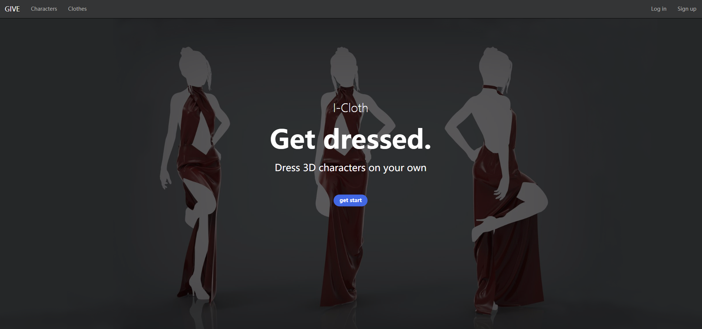
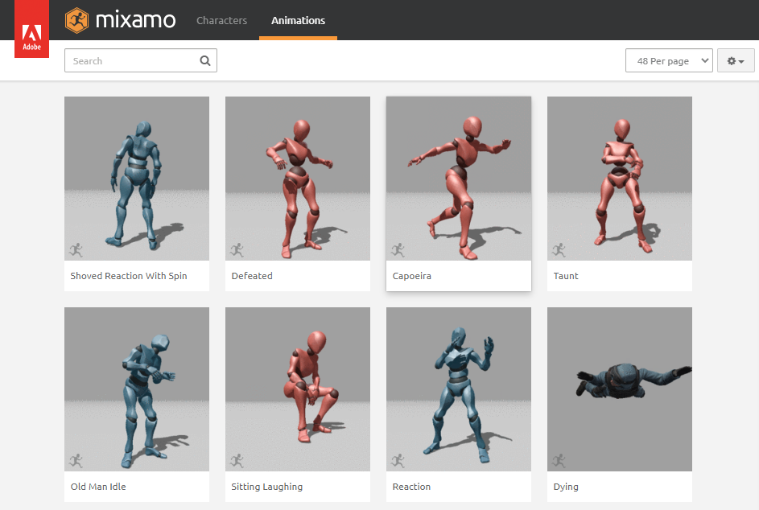
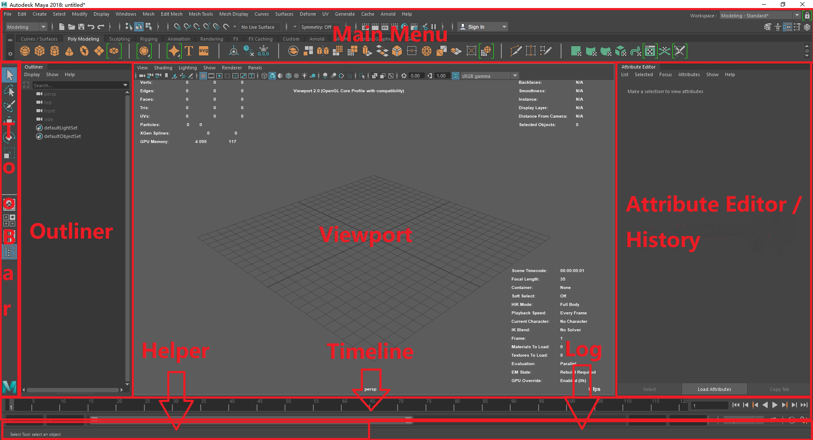

# I-Cloth Web Application

### 前端模块 ###
---
#### 主界面 index.html ####
主界面主要展示了系统的功能总览，功能主要包括用户登录、注册，并实现到其它页面的导航。
主界面可以跳转到以下任意界面。在实现跳转之前，必须强制用户处于登录状态，这样方便后续的所有操作。


#### 角色界面 character.html ####
角色界面包含了可供用户进行布料模拟的所有角色模型。
用户可通过上传模型来丰富这个素材库，也可以下载想要的模型用于自己的项目。


#### 服装界面 cloth.html ####
服装界面包含了可供用户进行布料模拟的所有服装。
用户可通过上传模型来丰富这个素材库，也可以下载想要的模型用于自己的项目。


#### 工作界面 workspace.html ####
用户可在工作界面新建项目、导入本地项目、保存项目，进而进行后续编辑工作：导入人物、衣服、并进行布料解算。


本应用将所有数据保存在本地，且不会使用indexDB，而是使用文件系统来保存用户数据。
此外，将利用浏览器的localStorage来存储配置本应用的一些配置文件。

当创建项目后，在工程目录下将自动生成如下文件夹
```
project_path
|--cache // for icloth results
|--scenes // for user data in the scene
|--source_images // for texture
|--workspace.proj // for open a project
```

工作界面将分为以下八大组件：
> MainMenu：所有功能的汇总

> Toolbar：模型操作与视图操作

> Outliner：大纲视图，用以显示场景中所有实体

> Viewport：3D视窗

> Attribute Editor：属性编辑器，不同实体的属性不同

> History：内存中有限长度循环队列实现，类Photoshop中的历史

> Timeline：时间条，用以播放动画

> Information：辅助显示对应操作相关帮助/显示操作结果的日志



#####以下为各个组件中的具体设计
>+ **MainMenu**
>    + File
>        + *New Scene*
>          *Open Scene...*
>          *Save Scene*
>        + *Import...*
>          *Export...*
>          *Export Selection...*
>        + *New Project*
>          *Set Project*
>        + *Exit*
>    + Edit
>        + *Undo*
>          *Redo*
>          *Repeat*
>        + *Duplicate*
>          *Delete*
>        + *Group*
>          *UnGroup*
>        + *Parent*
>          *UnParent*
>    + Create
>        + *PolygonPrimitives*
>            + *Sphere*
>              *Cube*
>              *Cylinder*
>              *Cone*
>              *Torus*
>              *Plane*
>        + *Lights*
>            + *AmbientLight*
>              *DirectionalLight*
>              *HemisphereLight*
>              *PointLight*
>              *Spotlight*
>        + *Cameras*
>            + *OrthographicCamera*
>              *PerspectiveCamera*
>        + *CV Tools*
>            + *CV Curve Tool*
>              *EP Curve Tool*
>              *Bezier Curve Tool*
>    + Window (_check box to toggle UI elements_)
>        + *Outliner*
>        + *AttributeEditor*
>        + *TimeSilder*
>        + *HelpLine*
>        + *LogInfo*
>        + *Preference*
>             + *Language*
>             + *BackgroundColor*
>             + *Display*
>               + *GeometryInfo*
>               + *FrameRate*
>    + ICloth:
>         + *Create Passive Collider*
>           *Create iCloth*
>           *Create Constraints*
>         + *Simulate*
>    + Render
>         + *Render*

> + **Toolbar**
>     + ToolBox
>         + *SelectTool*
>         + *MoveTool*
>           *RotateTool*
>           *ScaleTool*
>     + ViewBox
>         + *SinglePerspectiveView*
>           *FourView*
>           *Ortho/PerspView*
>         + *ToggleOutliner*

> + **Outliner**
>     + defaultCameraSet
>         + *persp*
>           *top*
>           *front*
>           *side*
>           ~~*bottom*~~
>           ~~*back*~~
>           ~~*left*~~
>     + defaultLightSet
>         + ambientLight
>     + scene
>         + cameras...
>         + lights...
>         + objects...
>         + solver...
>         + iCloth...
>         + Rigid...

> + **Viewport** (Canvas for WebGL)
>     + ModelInfo：
>         + *Verts*
>           *Edges*
>           *Faces*
>           *Tris*
>           *UVs*
>     + RenderedImage
>         + *Cameras: different form for different types of cameras*
>         + *Lights: different form for different types of lights*
>         + *Objects: shown in different ways*
>         + *Solver: shown as the down arrow represent the gravity*
>         + *ICloth: shown as the pink wireframe of the original object*
>         + *Rigid: shown as a pointer represents the center of the mass of the object*
>         + *UI Elements: different ui elements for different tools*
>     + Coordinates
>     + CameraInfo
>     + FPSInfo

> + **Attribute Editor**
>     + Object
>         + *Type*
>           *UUID*
>           *Name*
>         + *Position*
>           *Rotation*
>           *Scale*
>         + *Shadow*
>           *Visible*
>           *Frustum Cull*
>           *Render Order*
>     + Geometry
>          + *Type*
>          + *UUID*
>          + *Name*
>          + *Width*
>            *Height*
>            *Depth*
>          + *OtherAttributes...*
>     + Material
>         + *Type*
>           *UUID*
>           *Name*
>         + Sample(img)
>         + Attributes & Textures
>     + Solver
>         + *Gravity and Wind*
>             + *Gravity*
>               *Gravity Direction*
>             + *Air Density*
>               *Wind Speed*
>               *Wind Direction* 
>               *Wind Noise*
>         + *Ground Plane*
>             + *Use Plane(checkbox)*
>             + *Plane Origin*
>               *Plane Normal*
>               *Plane Bounce*
>               *Plane Friction*
>               *Plane Stickness*
>             + *Solver Attributes*
>                 + *Substeps*
>                 + *Max Collision Iterations*
>             + *Time Attributes*
>                 + *Start Frame*
>                 + *End Frame*
>             + *Scale Attributes*
>                 + *Time Scale*
>                 + *Space Scale*
>         + *UUID*
>     + ICloth
>         + *Collisions*
>             + *Bounce*
>             + *Friction*
>             + *Stickiness*
>         + *Dynamic Properties(material of the cloth)*
>             + *Stretch Resistance*
>               *Compression Resistance*
>               *Bend Resistance*
>               *Bend Angle Dropoff*
>               *Shear Resistance*
>             + *Restitution Angle*
>               *Restitution Tension*
>             + *Rigidity*
>               *Deform Resistance*
>             + *Mass*
>               *Lift*
>               *Drag*
>               *Tangential Drag*
>               *Damp*
>               *Stretch Damp*
>         + *UUID*
>     + Rigid
>         + *Collisions*
>             + *Bounce*
>             + *Friction*
>             + *Stickness*
>         + *UUID*

> + **History**
>     + all history of manipulations 

> + **Timeline**
>     + TimeSilder
>         + *ProgressBar*
>         + *CurrentFrameInput*
>         + *PlayButtonGroup*
>             + *PlayForwardsButton*
>               *PlayBackwardsButton*
>               *StepForwardOneFrameButton*
>               *StepBackwardOneFrameButton*
>    + RangeSlider
>        + *StartTimeOfAnimation* 
>          *StartTimeOfRange*
>        + *RangeBar*
>        + *StopTimeOfRange* 
>          *StopTimeOfAnimation* 
>        + *PlaybackRate*
>        + *PlaybackMode*
>            + *LoopOn*
>            + *LoopOff*

> + **Information**
>     + HelpLine
>     + LogInfo

##### 快捷键设计：
> Q: 退出所有状态
> W: 移动
> E: 旋转
> R: 缩放
> A：按合适角度与比例显示整个场景
> F：按合适角度与比例显示当前物体
> G: 重复上一步命令
> Num1: 正常显示
> Num2: 平滑显示 + 原始线框
> Num3: 平滑显示
> Num4: 线框显示
> Num5: 着色
> Num6: 着色带贴图
> Num7: 灯光
> Del: 删除物体
> RMB: 选点、线、面、体
> Ctrl+N: 新建一个项目
> Ctrl+O: 打开一个项目
> Ctrl+S: 保存当前项目
> Ctrl+D: 复制物体
> Ctrl+G: 组化
> Crtl+Y: redo
> Ctrl+Z: undo
> Space: 在视图之间切换
> Space+LMB/RMB: 切换摄像机
> Alt+LMB: 旋转摄像机
> Alt+MMB: 移动摄像机
> Alt+RMB: 改变摄像机的FOV

#### 后台界面 admin.html ####
只有管理员可以在首页登录，用于管理所有后台数据库的数据。


### 数据库设计 ###
---
#### server端mySQL数据库
```sql
CREATE TABLE IF NOT EXISTS `user`(
    `id` INT NOT NULL auto_increment,
    `username` VARCHAR(50) NOT NULL, 
    `password` char(32) NOT NULL,
    `email` VARCHAR(50) NOT NULL,
    `register_time` DATETIME NOT NULL,
    `last_login_time` DATETIME,

    PRIMARY KEY(`id`),
    UNIQUE INDEX(`username`),
    UNIQUE INDEX(`email`),
) ENGINE=InnoDB DEFAULT CHARSET=utf8 AUTO_INCREMENT=1;

CREATE TABLE IF NOT EXISTS `model`(
    `id` INT NOT NULL auto_increment,
    `type` ENUM('CHARACTER', 'CLOTH'),
    `url` VARCHAR(255) NOT NULL,
    `title` VARCHAR(255) NOT NULL,
    `uid` INT NOT NULL,

    PRIMARY KEY(`id`),
    FOREIGN KEY(`uid`) 
        REFERENCES `user`(`id`) 
        ON UPDATE CASCADE ON DELETE CASCADE,
    UNIQUE INDEX(`url`),
) ENGINE=InnoDB DEFAULT CHARSET=utf8 AUTO_INCREMENT=1;

CREATE TABLE IF NOT EXISTS `material`(
    `id` INT NOT NULL auto_increment,
    `url` VARCHAR(255) NOT NULL,
    `mid` INT NOT NULL,
    
    PRIMARY KEY(`id`),
    FOREIGN KEY(`mid`) 
        REFERENCES `model`(`mid`) 
        ON UPDATE CASCADE ON DELETE CASCADE,
    UNIQUE INDEX(`url`),
) ENGINE=InnoDB DEFAULT CHARSET=utf8 AUTO_INCREMENT=1;

CREATE TABLE IF NOT EXISTS `texture`(
    `id` INT NOT NULL auto_increment,
    `url` VARCHAR(255) NOT NULL,
    `mid` INT NOT NULL,
    PRIMARY KEY(`id`),
    FOREIGN KEY(`mid`) 
        REFERENCES `model`(`mid`) 
        ON UPDATE CASCADE ON DELETE CASCADE,
    UNIQUE INDEX(`url`),
) ENGINE=InnoDB DEFAULT CHARSET=utf8 AUTO_INCREMENT=1;


CREATE TABLE IF NOT EXISTS `workspace`(
    `id` INT NOT NULL auto_increment,
    `url` VARCHAR(255) NOT NULL,
    `uid` INT NOT NULL,
    PRIMARY KEY(`id`),
    FOREIGN KEY(`uid`) 
        REFERENCES `user`(`id`) 
        ON UPDATE CASCADE ON DELETE CASCADE,
    UNIQUE INDEX(`url`),
)ENGINE=InnoDB DEFAULT CHARSET=utf8 AUTO_INCREMENT=1;
```

#### client端localStorage
```javascript
var config = {
    'language': 'en',
    'autosave': true,
    'renderer': { 
        'antialias': true,
        'shadows': true,
        'shadowType': 1, // PCF
        'physicallyCorrectLights': false,
        'toneMapping': 0, // NoToneMapping
        'toneMappingExposure': 1
    }
}
```

### 前后端交互 ###
---
前后端通过ajax与php通信，后端会用 go + grpc 重写。
#####用户登录：login.php 前端通过ajax请求
#####用户注册：register.php 前端通过ajax请求
#####布料模拟：main.php 前端通过Websocket与后端建立双向数据传输通道(我不确定这是否能行)
当用户点击MainMenu->iCloth->Simulate后，系统将上传被指定为Ridig的对象作为人体，被指定为iCloth的对象作为布料到指定的文件夹。同时，前端将上传solver中的一系列参数，如重力方向、风速、解算步长、时间与空间尺寸，模拟的起始与终止帧，以及Rigid中的碰撞相关系数和iCloth中的碰撞、布料材质等相关系数，作为程序的输入，调用give-simulate进行模拟。程序将执行进度信息和结果返还给客户端，其中执行进度信息将被显示在LogInfo窗口中，而最终结果将被下载到指定的缓存文件夹中。最后，在浏览器中加载结果。